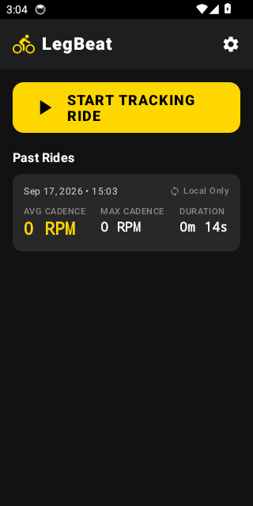
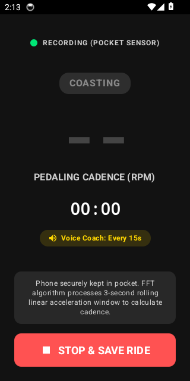
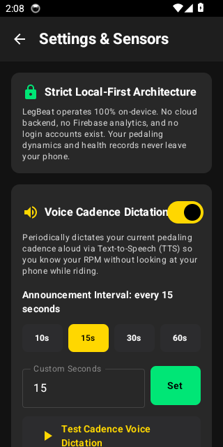
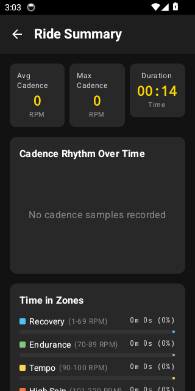
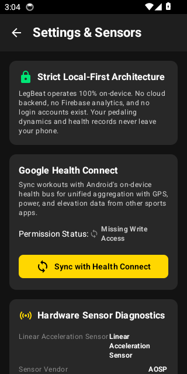
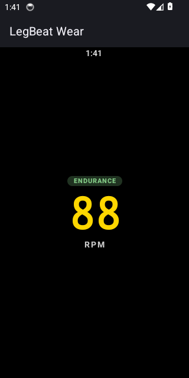

# LegBeat: Clean Architecture Cycling Cadence Tracker

LegBeat is an enterprise-grade, multi-module Android and Wear OS application in Kotlin that calculates pedaling cadence (RPM) directly from a smartphone kept in a cyclist's jersey or shorts pocket. Built using Clean Architecture and Jetpack Compose, LegBeat features on-device Fast Fourier Transform (FFT) signal processing, Garmin FIT protocol encoding, Google Health Connect privacy-first data storage, periodic Voice Cadence Dictation (Text-to-Speech), and low-latency Wear OS streaming.

---

## 📱 Live SDK & Device Verification Walkthrough

The application modules have been built, verified, and installed onto the Android SDK runtime (Android 14 API 34 ARM64). Below are live captures of the fully functional user flows:

| **Mobile Dashboard** | **Active Ride (Voice Coach)** | **Settings & Voice Dictation** |
| :---: | :---: | :---: |
|  |  |  |

| **Post-Ride Summary** | **Health Connect & FIT Export** | **Wear OS Heads-Up Display** |
| :---: | :---: | :---: |
|  |  |  |

---

## 🎙️ Periodic Voice Cadence Dictation (Pocket Audio Coach)

When cycling with a smartphone in a jersey pocket, looking down at a screen can be inconvenient or dangerous. LegBeat features an on-device **Voice Cadence Dictation** engine:
- **Periodic Text-to-Speech (TTS)**: Dictates your current pedaling cadence aloud into your headphones or speaker (e.g., *"88 RPM"* or *"Cadence zero"*).
- **Customizable Announcement Interval**: Configure exactly how often you want announcements (quick presets: `10s`, `15s`, `30s`, `60s`, or any custom number of seconds typed by the user).
- **Persistent Preferences**: Managed by `VoiceSettingsRepository` using local preferences.
- **Mid-Ride Quick Toggle**: Toggle or mute the voice coach directly from `ActiveRideScreen` with a single tap on the interactive chip without interrupting your ride.
- **Test Button**: Audition the voice engine in Settings with a single tap.

---

## ⌚ Wear OS Heads-Up Display (`:wear`)

A dedicated Wear OS companion app provides a high-contrast heads-up cadence display:
- **Low-Latency Streaming**: Streams timestamped binary packets from the phone over Google Play Services Wearable Data Layer (`/legbeat/cadence`).
- **Maximum Sunlight Legibility**: Rendered with **74sp** extra-bold typography in Electric Yellow and color-coded cadence zone badges (Recovery, Endurance, Tempo, High-Spin).
- **Watchdog Timer**: Automatically falls back to `"--"` if no cadence packet arrives within the timeout window.
- **Ambient Mode Support**: Leverages `AmbientLifecycleObserver` with burn-in protection and reduced-rate monochrome rendering when the cyclist's wrist is lowered.

---

## 📐 Architecture & Design Documentation

Comprehensive High-Level Design (HLD) and Low-Level Design (LLD) specifications are included in the repository:

- **Android Mobile Application (`:mobile`)**:
  - [Mobile High-Level Design (HLD)](docs/android/HLD.md)
  - [Mobile Low-Level Design (LLD)](docs/android/LLD.md)
- **Wear OS Application (`:wear`)**:
  - [Wear OS High-Level Design (HLD)](docs/wearos/HLD.md)
  - [Wear OS Low-Level Design (LLD)](docs/wearos/LLD.md)

---

## 📦 Project Modular Structure

The codebase is organized into six modules following Clean Architecture and Gradle Version Catalogs:

```
legbeat/
├── build.gradle.kts
├── settings.gradle.kts
├── gradle/
│   └── libs.versions.toml             # Central Gradle Version Catalog
├── docs/
│   ├── screenshots/                   # Live device verification captures
│   ├── android/                       # Mobile HLD & LLD
│   └── wearos/                        # Wear OS HLD & LLD
├── mobile/                            # Android Phone Application (Compose, Foreground Service)
│   ├── src/main/java/com/legbeat/
│   │   ├── di/                        # Hilt Dependency Injection Modules
│   │   ├── service/                   # Foreground Tracking Service, Audio Announcer, WakeLock
│   │   ├── wear/                      # Wearable Data Layer MessageClient Streamer
│   │   └── presentation/              # Jetpack Compose UI (Dashboard, Active Ride, Settings)
├── wear/                              # Wear OS Micro-Application (Compose for Wear)
│   ├── src/main/java/com/legbeat/wear/
│   │   ├── di/                        # Wear Hilt Modules
│   │   ├── data/                      # WearableListenerService & Watchdog Timer
│   │   └── presentation/              # High-Contrast Heads-Up UI & Ambient Mode
├── core/                              # Shared Domain & Utilities
│   ├── src/main/java/com/legbeat/core/
│   │   ├── model/                     # Domain Entities (Ride, Sample, CadenceZone)
│   │   ├── dsp/                       # Cooley-Tukey FFT, Hann Window, Peak Detection
│   │   └── ble/                       # Extensible BLE Sensor Contracts (HR, Power)
├── analytics/                         # Room Database & On-Device Analytics
│   ├── src/main/java/com/legbeat/analytics/
│   │   ├── db/                        # Room Database, DAOs, Entities
│   │   ├── engine/                    # Time-in-Zones & Offline Coaching Insights
│   │   └── repository/                # RideRepository Implementation
├── fit/                               # Garmin FIT SDK Integration
│   ├── src/main/java/com/legbeat/fit/
│   │   ├── FitActivityEncoder.kt      # Binary .fit file serializer
│   │   └── FitValidator.kt            # FIT compliance verification
└── healthconnect/                     # Google Health Connect Integration
    ├── src/main/java/com/legbeat/healthconnect/
        ├── HealthConnectManager.kt    # Permission contracts & Client facade
        └── ExerciseRecordMerger.kt    # Session & Cadence series record merger
```

---

## 🔬 Core Signal Processing Pipeline (`:core`)

1. **Sensor Acquisition**: `Sensor.TYPE_LINEAR_ACCELERATION` sampled at 50 Hz (~20ms interval).
2. **Sliding Window Buffer**: `RollingWindowBuffer` maintains a 3.0-second FIFO buffer (150 samples).
3. **PCA Axis Projection**: `SignalResampler` projects 3D acceleration vectors onto the 1st Principal Component, preserving sinusoidal wave polarity and preventing frequency doubling.
4. **Spectral Windowing**: `HannWindow` attenuates spectral edge discontinuities.
5. **Radix-2 FFT**: `CooleyTukeyFft` zero-pads the buffer to 256 points for optimal frequency bin resolution ($\Delta f \approx 0.195\text{ Hz}$).
6. **Harmonic Peak Extraction & Noise Gating**: `CadenceExtractor` identifies the dominant peak within the human pedaling band ($1.0 - 2.5\text{ Hz} \iff 60 - 150\text{ RPM}$), applying parabolic interpolation for fractional precision. Movement below $RMS < 0.35\text{ m/s}^2$ is gated to 0 RPM (coasting).
7. **Exponential Smoothing**: `ExponentialMovingAverage` ($\alpha = 0.35$) stabilizes display fluctuations while tracking cadence transitions.

---

## 🔒 Strict Local-First Architecture & Health Connect

- **100% On-Device**: Zero cloud backend, zero Firebase dependencies, zero user logins.
- **Google Health Connect**:
  - Permissions declared in `AndroidManifest.xml` with mandatory rationale handlers.
  - Granular permission checking and OS contract launching via `PermissionController`.
  - Atomically writes `ExerciseSessionRecord` (Biking) and `CyclingPedalingCadenceRecord` with idempotent `clientRecordId` keys.
- **Garmin FIT Export**: Generates compliant binary `.fit` files with `FileIdMesg`, `SessionMesg`, and `RecordMesg` for direct upload to Strava, Garmin Connect, and TrainingPeaks.

---

## 🛠️ Build, Test & Run Instructions

### Prerequisites
- JDK 17 or JDK 21
- Android SDK 35 (Platform Tools, Build Tools 35.0.0)

### Automated Testing
```bash
# Run unit tests across all shared modules (core and fit)
./gradlew :core:test :fit:test

# Full multi-module verification
./gradlew test
```

### Installing & Running Mobile App
```bash
# Assemble and install Mobile debug APK on connected device or emulator
./gradlew :mobile:installDebug

# Launch the Mobile application
adb shell am start -n com.legbeat/.presentation.MainActivity
```

### Installing & Running Wear OS App
```bash
# Assemble and install Wear OS debug APK
./gradlew :wear:installDebug

# Launch Wear OS Heads-Up Cadence screen
adb shell am start -n com.legbeat.wear/.presentation.WearCadenceActivity

# Optional: Simulate a test cadence value on Wear OS (e.g., 88 RPM)
adb shell am start -n com.legbeat.wear/.presentation.WearCadenceActivity --ei rpm 88
```
