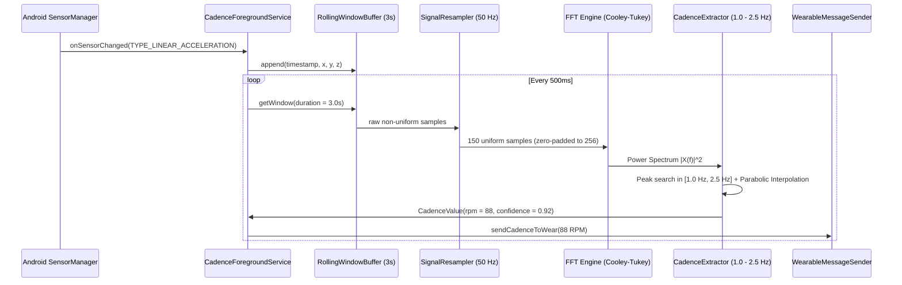
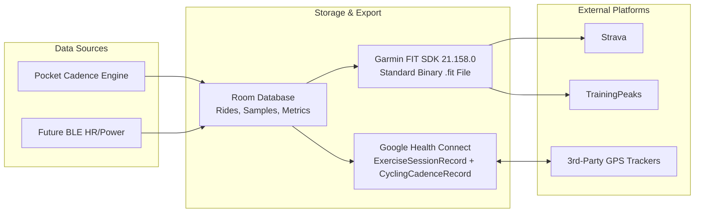

# LegBeat Mobile Application (:mobile) - High-Level Design (HLD)

## 1. System Overview

**LegBeat** is a high-performance cycling cadence tracker that calculates pedaling cadence (RPM) directly from a smartphone kept in a cyclist's jersey or shorts pocket. By leveraging smartphone inertial sensors (`Sensor.TYPE_LINEAR_ACCELERATION`), Fast Fourier Transform (FFT) signal processing, and Clean Architecture, LegBeat delivers real-time cadence without dedicated crank sensors, while seamlessly interoperating with the global endurance sports ecosystem (Garmin FIT protocol, Google Health Connect, and Wear OS).

### 1.1 Key Objectives
- **Accurate Pocket Cadence Detection**: Isolate thigh rotational harmonics from road vibrations and torso motion within the human cadence band (60 – 150 RPM / 1.0 – 2.5 Hz).
- **Zero Cloud Lock-In**: On-device persistence (Room) and Health Connect as the primary data exchange bus.
- **Interoperability**: Native Garmin `.fit` binary export compatible with Strava, TrainingPeaks, and Wahoo.
- **Real-Time Streaming**: Low-latency Wear Data Layer streaming to Wear OS smartwatches.
- **Hardware Scalability**: Prepared for future Bluetooth Low Energy (BLE) Heart Rate Monitors (GATT 0x180D) and Cycling Power Meters (GATT 0x1818).

---

## 2. System Architecture & Clean Architecture Layers

LegBeat Mobile follows strict **Clean Architecture** principles, enforcing separation of concerns, testability, and independence from Android framework classes in domain logic.

```mermaid
graph TD
    subgraph Presentation Layer [":mobile (Presentation)"]
        UI[Jetpack Compose UI<br/>Dashboard / Active Ride / History]
        VM[ActiveRideViewModel / DashboardViewModel]
    end

    subgraph Domain Layer [":core (Domain)"]
        UC1[ProcessSensorSignalUseCase]
        UC2[RecordRideUseCase]
        UC3[CalculateCadenceZonesUseCase]
        UC4[ExportFitFileUseCase]
        UC5[SyncHealthConnectUseCase]
        Interfaces[Repository & BLE Sensor Interfaces]
    end

    subgraph Data & Infrastructure Layer [":analytics, :healthconnect, :fit, :mobile"]
        SensorDS[LinearAccelerationSensorDataSource]
        WearSender[WearableMessageClientSender]
        RoomRepo[RideRepositoryImpl (Room DB)]
        HCRepo[HealthConnectRepositoryImpl]
        FitRepo[FitFileEncoderRepositoryImpl]
        BLERepo[BleSensorRepositoryImpl (Extensible)]
    end

    UI --> VM
    VM --> UC1
    VM --> UC2
    VM --> UC3
    VM --> UC4
    VM --> UC5
    UC1 --> Interfaces
    UC2 --> Interfaces
    UC3 --> Interfaces
    UC4 --> Interfaces
    UC5 --> Interfaces
    RoomRepo -.-> Interfaces
    HCRepo -.-> Interfaces
    FitRepo -.-> Interfaces
    BLERepo -.-> Interfaces
    SensorDS --> UC1
    UC1 --> WearSender
```

### 2.1 Multi-Module Breakdown

| Module | Type | Responsibilities |
| :--- | :--- | :--- |
| `:mobile` | Android Application | Android UI (Jetpack Compose), Foreground Service, Sensor integration, Wear Data Layer sender, Hilt Application setup. |
| `:wear` | Android Application (Wear OS) | Wear OS UI (Compose for Wear), Ambient mode lifecycle, MessageClient receiver. |
| `:core` | Android Library / Kotlin | Domain models (`Ride`, `CadenceSample`, `CadenceZone`), dispatchers, signal processing math (FFT, Windowing, Peak Detection), BLE hardware interfaces. |
| `:analytics` | Android Library | Room Database (`RideDao`, `SampleDao`), offline coaching analytics engine (Time-in-Zones, Cardiovascular Strain vs Cadence join). |
| `:fit` | Android Library / Kotlin | Garmin FIT SDK integration (`com.garmin:fit:21.158.0`), binary FIT encoder (`FileIdMesg`, `SessionMesg`, `RecordMesg`, `ActivityMesg`). |
| `:healthconnect`| Android Library | Google Health Connect SDK integration, permissions, `ExerciseSessionRecord`, `CyclingPedalingCadenceRecord` series merging. |

---

## 3. Physics & Pocket Sensor Processing Pipeline

### 3.1 Biomechanical Motion Model
When a phone is placed in a front pocket (either cycling jersey or shorts):
- **Shorts Pocket**: The phone tilts back and forth as the thigh undergoes cyclic hip flexion and extension. The longitudinal/vertical acceleration displays a periodic waveform with fundamental frequency $f_0$ equal to the pedal revolutions per second.
- **Jersey Rear Pocket**: Cyclists rock their pelvic girdle / lower back synchronously with pedaling force application. The vertical acceleration displays harmonic peaks at $f_0$ and $2f_0$.
- **Cadence Range**: Normal pedaling falls strictly between **60 RPM (1.0 Hz)** and **150 RPM (2.5 Hz)**. Any movement outside this band (< 1.0 Hz or > 2.5 Hz) is categorized as walking, road bumps, or noise.



### 3.2 Signal Processing Stages
1. **Linear Acceleration Acquisition**: `Sensor.TYPE_LINEAR_ACCELERATION` strips static 9.81 m/s² gravity using the device sensor fusion filter.
2. **Magnitude & Projection**: Compute euclidean magnitude $\sqrt{x^2 + y^2 + z^2}$ to make cadence calculation orientation-agnostic (phone can be upside down, sideways, or tilted).
3. **Sliding Window**: 3.0-second rolling buffer (at 50 Hz = 150 samples). A 3-second window captures at least 3 full pedal strokes even at 60 RPM.
4. **Resampling & Hann Windowing**: Resample non-uniform hardware sensor timestamps to uniform 50 Hz, then multiply by a Hann window $w(n) = 0.5 - 0.5 \cos\left(\frac{2\pi n}{N-1}\right)$ to eliminate spectral leakage.
5. **Radix-2 FFT & Zero-Padding**: Zero-pad 150 samples to 256 points for optimal power-of-2 Cooley-Tukey FFT.
6. **Harmonic Peak Extraction with Parabolic Interpolation**: Locate dominant peak within the $1.0\text{ Hz} \le f \le 2.5\text{ Hz}$ passband. Perform parabolic peak interpolation using adjacent bins to obtain fractional frequency accuracy ($\pm 0.5\text{ RPM}$).
7. **Noise Floor & Coasting Detection**: If peak energy or window RMS is below $0.35\text{ m/s}^2$, the cyclist is coasting or stopped; output is clamped to 0 RPM.

---

## 4. Hardware Scalability: BLE Sensor Architecture

To future-proof LegBeat for Bluetooth Low Energy peripherals:
- **`BlePeripheralManager` Interface**: Common contract for peripheral scanning, connecting, and lifecycle management.
- **Heart Rate Monitor (GATT Service `0x180D`, Characteristic `0x2A37`)**: Parses Heart Rate Measurement flags and delivers BPM stream.
- **Cycling Power Meter (GATT Service `0x1818`, Characteristic `0x2A63`)**: Parses instantaneous power in Watts and pedal cadence.
- Unified time-series alignment: All metrics (Pocket Cadence, BLE Cadence, BLE Heart Rate, BLE Power) share monotonic epoch timestamps for unified Room DB and FIT file aggregation.

---

## 5. Persistence, Health Connect & FIT Ecosystem Interoperability



### 5.1 Garmin FIT SDK Integration
- Official SDK: `com.garmin:fit:21.158.0`.
- Encodes binary activity files with `FileIdMesg`, `SessionMesg` (Sport.CYCLING), and high-frequency `RecordMesg` entries (timestamp, cadence, speed/distance).
- Exported `.fit` files pass Garmin FitSDK validator and can be uploaded directly to Strava, Garmin Connect, and TrainingPeaks.

### 5.2 Google Health Connect
- Uses `ExerciseSessionRecord` (type `EXERCISE_TYPE_BIKING`) as the container.
- Appends `CyclingPedalingCadenceRecord` series samples containing local timestamps and calculated RPM.
- When other fitness apps record simultaneous GPS/elevation data, Android Health Connect aggregates both streams natively on device.

---

## 6. Execution Lifecycle & Background Reliability

- **Android Foreground Service (`CadenceTrackingService`)**: Runs with `ServiceInfo.FOREGROUND_SERVICE_TYPE_HEALTH` / `FOREGROUND_SERVICE_TYPE_CONNECTED_DEVICE`.
- **Partial WakeLock**: Held during active recording to prevent CPU sleep when phone screen is turned off in pocket.
- **Ongoing Notification**: Displays live cadence RPM, elapsed duration, and a one-tap "Stop & Save Ride" action.
- **Battery Optimization Whitelist Prompt**: Guides user to disable OEM battery restrictions for uninterrupted tracking.
