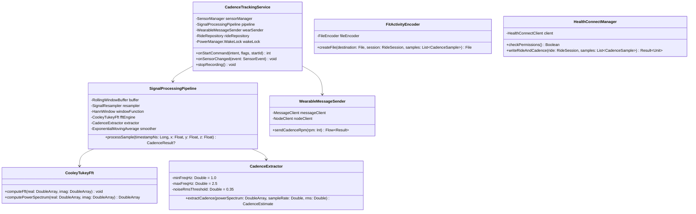
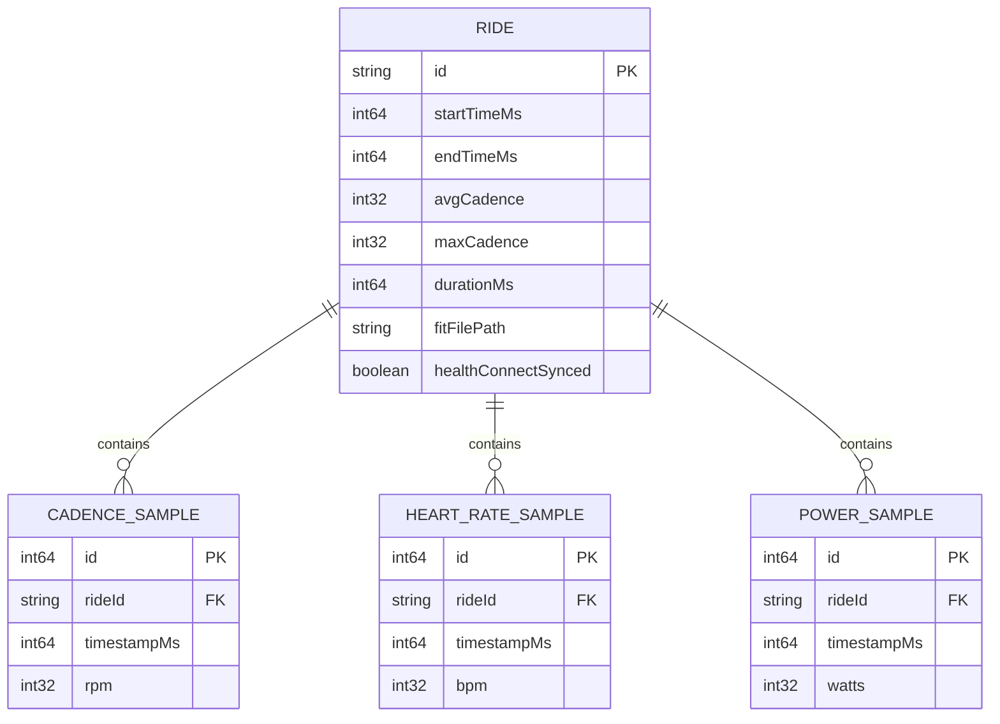

# LegBeat Mobile Application (:mobile) - Low-Level Design (LLD)

## 1. Class Structure & Module Dependencies

The `:mobile` module depends on `:core`, `:analytics`, `:healthconnect`, and `:fit`.



---

## 2. Signal Processing Pipeline Detailed Specification

### 2.1 Sensor Sample Ring Buffer (`RollingWindowBuffer`)
```kotlin
data class AccelSample(
    val timestampNs: Long,
    val magnitude: Float // sqrt(x^2 + y^2 + z^2)
)

class RollingWindowBuffer(
    val windowDurationNs: Long = 3_000_000_000L // 3.0 seconds
) {
    private val buffer = ArrayDeque<AccelSample>(250)

    @Synchronized
    fun addSample(timestampNs: Long, x: Float, y: Float, z: Float) {
        val magnitude = sqrt(x * x + y * y + z * z)
        buffer.addLast(AccelSample(timestampNs, magnitude))
        // Evict samples older than (latestTimestamp - windowDurationNs)
        val cutoff = timestampNs - windowDurationNs
        while (buffer.isNotEmpty() && buffer.first().timestampNs < cutoff) {
            buffer.removeFirst()
        }
    }

    @Synchronized
    fun getSnapshot(): List<AccelSample> = buffer.toList()
}
```

### 2.2 Resampling & Windowing (`SignalResampler`, `HannWindow`)
Accelerometers deliver non-uniformly spaced callbacks. We resample to a constant rate $F_s = 50\text{ Hz}$ ($T_s = 20\text{ ms}$) using linear interpolation:
- Window length: $N_{target} = 150$ points for 3.0s.
- Zero-padded length: $N_{fft} = 256$ points (next power of 2).
- Hann window weight:
  $$w[n] = 0.5 \left(1 - \cos\left(\frac{2\pi n}{N-1}\right)\right), \quad 0 \le n < N$$

### 2.3 Cooley-Tukey Radix-2 FFT Engine (`CooleyTukeyFft`)
- In-place bit-reversal permutation followed by butterfly operations:
  $$X[k] = \sum_{n=0}^{N-1} x[n] e^{-j 2\pi k n / N}$$
- Power spectrum:
  $$P[k] = \text{Re}(X[k])^2 + \text{Im}(X[k])^2$$
- Frequency at bin $k$:
  $$f_k = \frac{k \cdot F_s}{N_{fft}}$$

### 2.4 Peak Extraction with Parabolic Interpolation (`CadenceExtractor`)
1. Determine target bin indices:
   $$k_{min} = \left\lceil \frac{1.0 \times 256}{50} \right\rceil = 6, \quad k_{max} = \left\lfloor \frac{2.5 \times 256}{50} \right\rfloor = 12$$
2. Find index $k^*$ maximizing $P[k]$ for $k \in [k_{min}, k_{max}]$.
3. Parabolic Interpolation:
   Given bin values $\alpha = P[k^*-1], \beta = P[k^*], \gamma = P[k^*+1]$, the fractional bin shift $\delta \in [-0.5, 0.5]$ is:
   $$\delta = \frac{1}{2} \cdot \frac{\alpha - \gamma}{\alpha - 2\beta + \gamma}$$
   Interpolated dominant frequency:
   $$f^* = \frac{(k^* + \delta) \cdot F_s}{N_{fft}}$$
   Cadence:
   $$\text{RPM}_{raw} = f^* \times 60$$
4. Noise / Coasting Gate:
   Calculate Root Mean Square (RMS) of linear acceleration over the window:
   $$\text{RMS} = \sqrt{\frac{1}{N} \sum_{n=0}^{N-1} (a_n - \mu)^2}$$
   If $\text{RMS} < 0.35\text{ m/s}^2$ or $\frac{P[k^*]}{\sum P[k]} < 0.25$, then $\text{RPM} = 0$.

### 2.5 Smoothing (`ExponentialMovingAverageSmoother`)
$$\text{RPM}_{smooth} = \alpha \cdot \text{RPM}_{raw} + (1 - \alpha) \cdot \text{RPM}_{prev}, \quad \text{with } \alpha = 0.35$$

---

## 3. Wearable Data Layer Protocol

### 3.1 Network Protocol & Payload
- **Path**: `/legbeat/cadence`
- **Transport**: `MessageClient.sendMessage(nodeId, path, payload)`
- **Payload Schema**:
  ```
  Byte 0..3:  RPM (Int32, Big Endian)
  Byte 4..7:  Zone Code (Int32: 0=Idle, 1=Recovery, 2=Endurance, 3=Tempo, 4=HighSpin)
  Byte 8..15: Monotonic Timestamp (Int64, Milliseconds)
  ```
- Frequency: Dispatched every 500 ms (2 Hz updates) when cadence changes or heartbeat refresh.

---

## 4. Room Database Schema (:analytics)



### 4.1 SQL Table Definitions & Foreign Keys
```sql
CREATE TABLE rides (
    id TEXT PRIMARY KEY NOT NULL,
    startTimeMs INTEGER NOT NULL,
    endTimeMs INTEGER NOT NULL,
    avgCadence INTEGER NOT NULL,
    maxCadence INTEGER NOT NULL,
    durationMs INTEGER NOT NULL,
    fitFilePath TEXT,
    healthConnectSynced INTEGER NOT NULL DEFAULT 0
);

CREATE TABLE cadence_samples (
    id INTEGER PRIMARY KEY AUTOINCREMENT NOT NULL,
    rideId TEXT NOT NULL,
    timestampMs INTEGER NOT NULL,
    rpm INTEGER NOT NULL,
    FOREIGN KEY(rideId) REFERENCES rides(id) ON DELETE CASCADE
);
CREATE INDEX idx_cadence_ride_time ON cadence_samples(rideId, timestampMs);

-- Extensible hardware tables for future BLE sensor synchronization
CREATE TABLE heart_rate_samples (
    id INTEGER PRIMARY KEY AUTOINCREMENT NOT NULL,
    rideId TEXT NOT NULL,
    timestampMs INTEGER NOT NULL,
    bpm INTEGER NOT NULL,
    FOREIGN KEY(rideId) REFERENCES rides(id) ON DELETE CASCADE
);

CREATE TABLE power_samples (
    id INTEGER PRIMARY KEY AUTOINCREMENT NOT NULL,
    rideId TEXT NOT NULL,
    timestampMs INTEGER NOT NULL,
    watts INTEGER NOT NULL,
    FOREIGN KEY(rideId) REFERENCES rides(id) ON DELETE CASCADE
);
```

### 4.2 Offline Coaching Metrics & Timestamp Join
Query joining Cadence and Heart Rate over rolling 10-second buckets:
```sql
SELECT 
    (c.timestampMs / 10000) * 10000 AS windowTime,
    AVG(c.rpm) AS avgRpm,
    AVG(h.bpm) AS avgHr
FROM cadence_samples c
LEFT JOIN heart_rate_samples h 
    ON c.rideId = h.rideId 
    AND ABS(c.timestampMs - h.timestampMs) <= 2000
WHERE c.rideId = :targetRideId
GROUP BY windowTime
ORDER BY windowTime ASC;
```

---

## 5. Garmin FIT SDK Serialization Flow (:fit)

```kotlin
class FitActivityEncoderImpl @Inject constructor() : FitActivityEncoder {
    override fun encodeRide(
        outputFile: File,
        ride: RideEntity,
        cadenceSamples: List<CadenceSampleEntity>
    ): Result<File> = runCatching {
        val encoder = FileEncoder(outputFile, Fit.ProtocolVersion.V2_0)
        
        // 1. FileId Message
        val fileId = FileIdMesg().apply {
            type = com.garmin.fit.File.ACTIVITY
            manufacturer = Manufacturer.DEVELOPMENT
            product = 1
            serialNumber = 1001L
            timeCreated = DateTime(Date(ride.startTimeMs))
        }
        encoder.write(fileId)

        // 2. High-Frequency Record Messages
        cadenceSamples.forEach { sample ->
            val record = RecordMesg().apply {
                timestamp = DateTime(Date(sample.timestampMs))
                cadence = sample.rpm.toShort()
            }
            encoder.write(record)
        }

        // 3. Session Message
        val session = SessionMesg().apply {
            startTime = DateTime(Date(ride.startTimeMs))
            totalElapsedTime = (ride.durationMs / 1000.0).toFloat()
            totalTimerTime = (ride.durationMs / 1000.0).toFloat()
            sport = Sport.CYCLING
            subSport = SubSport.ROAD
            avgCadence = ride.avgCadence.toShort()
            maxCadence = ride.maxCadence.toShort()
        }
        encoder.write(session)

        // 4. Activity Message
        val activity = ActivityMesg().apply {
            timestamp = DateTime(Date(ride.endTimeMs))
            numSessions = 1
            totalTimerTime = (ride.durationMs / 1000.0).toFloat()
            type = Activity.MANUAL
        }
        encoder.write(activity)

        encoder.close()
        outputFile
    }
}
```

---

## 6. Google Health Connect Architecture (:healthconnect)

- Target SDK: `androidx.health.connect:connect-client:1.1.0-alpha11`.
- Permissions requested via `PermissionController.createRequestPermissionResultContract()`:
  - `HealthPermission.getWritePermission(ExerciseSessionRecord::class)`
  - `HealthPermission.getWritePermission(CyclingPedalingCadenceRecord::class)`
- Data insertion:
  1. Build `ExerciseSessionRecord` with `startTime`, `endTime`, `exerciseType = ExerciseSessionRecord.EXERCISE_TYPE_BIKING`.
  2. Build `CyclingPedalingCadenceRecord` containing `samples: List<CyclingPedalingCadenceRecord.Sample>`.
  3. Single batch atomic transaction via `healthConnectClient.insertRecords(listOf(sessionRecord, cadenceRecord))`.

---

## 7. Dependency Injection (Dagger-Hilt)

- `@HiltAndroidApp LegBeatApp`: Application level entry point.
- `SensorModule`: Provides `SensorManager`, `RollingWindowBuffer`, `SignalProcessingPipeline`.
- `DatabaseModule`: Provides `LegBeatDatabase`, `RideDao`, `CadenceSampleDao`.
- `WearableModule`: Provides `MessageClient`, `NodeClient`, `WearableMessageSender`.
- `FitModule`: Binds `FitActivityEncoder` to `FitActivityEncoderImpl`.
- `HealthConnectModule`: Provides `HealthConnectClient` and binds `HealthConnectManager`.
