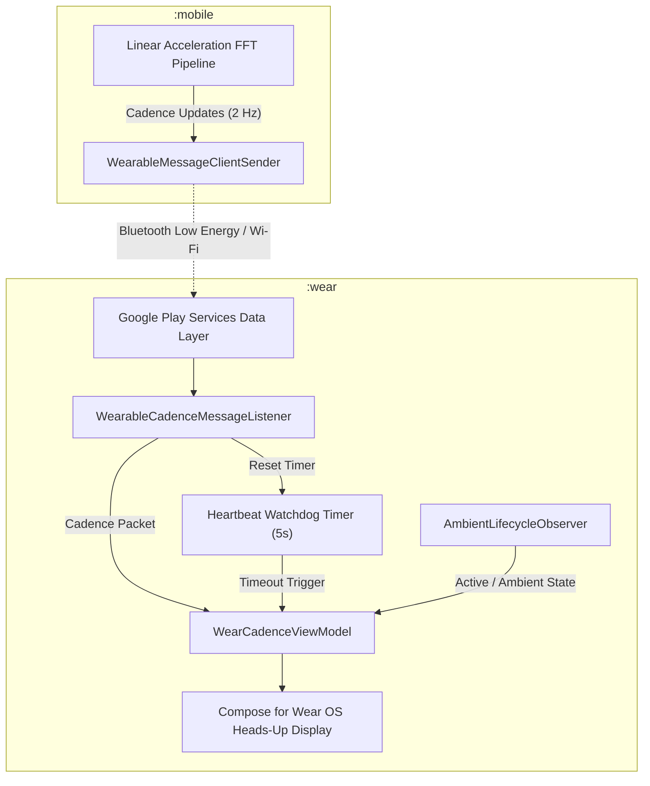
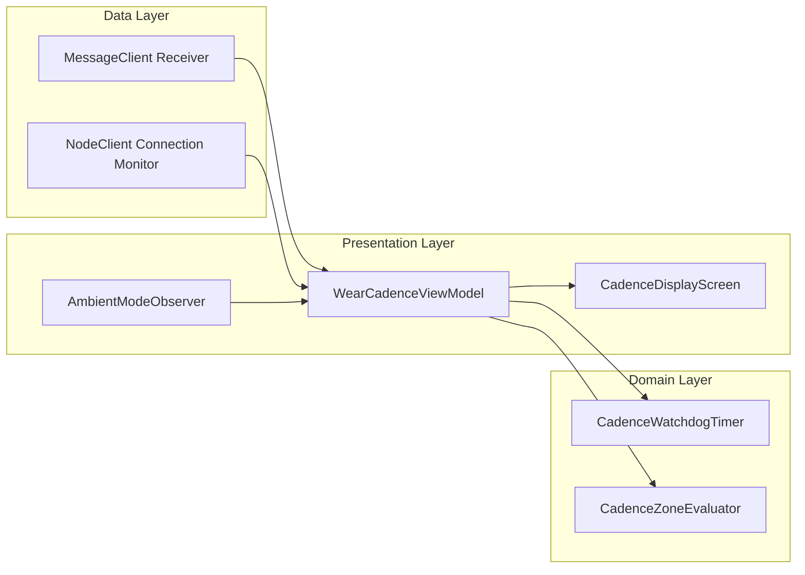
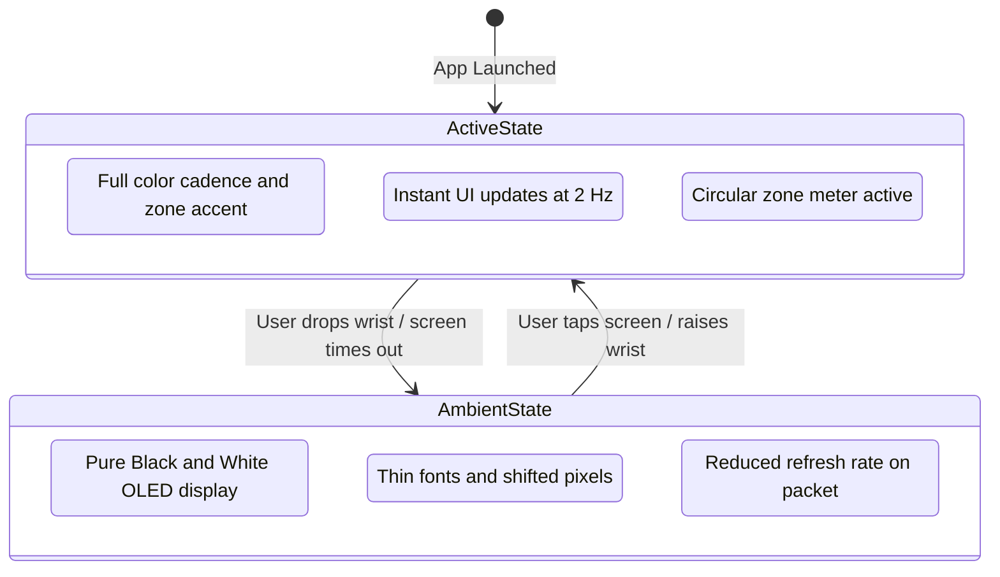

# LegBeat Wear OS Application (:wear) - High-Level Design (HLD)

## 1. System Overview

The **LegBeat Wear OS Application** (`:wear`) provides a distraction-free, ultra-high legibility cycling computer display mounted on the athlete's wrist or handlebar mount. It pairs over the Google Play Services Wearable Data Layer (`MessageClient`) to the handheld `:mobile` module, rendering real-time cadence (RPM), training zones, and connectivity status.

### 1.1 Key Objectives
- **Glanceable Heads-Up Interface**: Large, high-contrast typography (72sp+), bold glyphs, and zone-coded visual cues readable at 35+ km/h in bright sunlight.
- **Ambient & Always-On Efficiency**: Native integration with `AmbientLifecycleObserver` for low-refresh, power-saving monochrome display that guards against OLED burn-in.
- **Fail-Safe Staleness Detection**: Real-time watchdog timer detecting dropped Bluetooth connection or stopped pedaling, transitioning immediately to `"--"` if no cadence is received for > 5 seconds.
- **Independent Lightweight Footprint**: Minimal memory and CPU consumption, leaving the heavy FFT signal processing to the smartphone.

---

## 2. Architecture & Clean Separation

The `:wear` app follows Clean Architecture adapted for Wear OS micro-displays:

### 2.1 Layer Roles
1. **Data Layer**:
   - Registers `MessageClient.OnMessageReceivedListener` for path `/legbeat/cadence`.
   - Listens to node connection events via `CapabilityClient` / `NodeClient`.
2. **Domain Layer**:
   - `CadenceWatchdog`: 5-second countdown timer that automatically fires a `SignalStale` event if no packet arrives.
   - `CadenceZoneEvaluator`: Maps RPM to training zones (Recovery, Endurance, Tempo, High-Spin).
3. **Presentation Layer**:
   - `WearCadenceViewModel`: Exposes a unified `StateFlow<WearCadenceUiState>`.
   - `Compose for Wear OS`: Built with `androidx.wear.compose:compose-material3` and `androidx.wear.compose:compose-foundation`.

---

## 3. Ambient Mode & Power Strategy

When cycling, the watch display must stay active continuously without depleting the battery over a 3–6 hour ride.

### 3.1 Display Specifications Across Modes
| Property | Interactive (Active) Mode | Ambient (Low-Power) Mode |
| :--- | :--- | :--- |
| **Background** | Pure Black (`#000000`) | Pure Black (`#000000`) |
| **Cadence Digits** | High-contrast White/Yellow | Hollow/Thin White (`#FFFFFF`) |
| **Zone Meter** | Colored arc / pill indicator | Hidden or simple 1px outline |
| **Staleness Indicator** | Visible `"--"` with warning tint | Monospaced `"--"` |
| **Pixel Intensity** | Standard Anti-Aliasing | Zero anti-aliasing (burn-in prevention) |

---

## 4. Disconnection & Staleness Handling

In pocket-based cadence tracking, sensor drops can occur if the mobile app is terminated or Bluetooth connection drops.

1. **Watchdog Heartbeat Timer**: Every valid packet received resets a coroutine countdown timer (`delay(5000L)`).
2. **Timeout Transition**: If 5 seconds elapse without an incoming packet, the UI state automatically switches to:
   - `rpm = null`
   - `displayString = "--"`
   - `isStale = true`
3. **Automatic Recovery**: The instant a new packet arrives, the timer resets, and the live numeric value is restored without user interaction.
