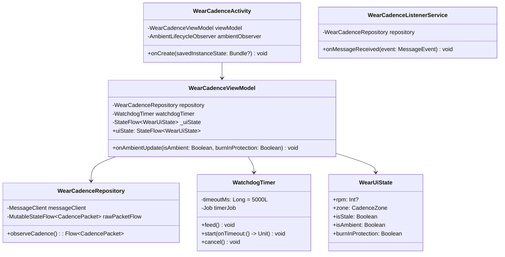

# LegBeat Wear OS Application (:wear) - Low-Level Design (LLD)

## 1. Class Diagram & Architecture



---

## 2. Wearable Data Layer Listener Implementation

### 2.1 Cadence Packet Structure
```kotlin
data class CadencePacket(
    val rpm: Int,
    val zoneCode: Int,
    val timestampMs: Long
) {
    companion object {
        const val CADENCE_PATH = "/legbeat/cadence"

        fun fromByteArray(bytes: ByteArray): CadencePacket? {
            if (bytes.size < 16) return null
            val buffer = ByteBuffer.wrap(bytes).order(ByteOrder.BIG_ENDIAN)
            val rpm = buffer.int
            val zoneCode = buffer.int
            val timestamp = buffer.long
            return CadencePacket(rpm, zoneCode, timestamp)
        }
    }
}
```

### 2.2 Background Listener Service (`WearCadenceListenerService`)
```kotlin
@AndroidEntryPoint
class WearCadenceListenerService : WearableListenerService() {

    @Inject
    lateinit var cadenceRepository: WearCadenceRepository

    override fun onMessageReceived(messageEvent: MessageEvent) {
        if (messageEvent.path == CadencePacket.CADENCE_PATH) {
            val packet = CadencePacket.fromByteArray(messageEvent.data)
            if (packet != null) {
                cadenceRepository.onPacketReceived(packet)
            }
        } else {
            super.onMessageReceived(messageEvent)
        }
    }
}
```

---

## 3. Watchdog Timer Implementation

The watchdog enforces the **5-second stale threshold** requirement:

```kotlin
class WatchdogTimer(
    private val scope: CoroutineScope,
    private val timeoutMs: Long = 5000L,
    private val onTimeout: () -> Unit
) {
    private var job: Job? = null

    fun feed() {
        job?.cancel()
        job = scope.launch {
            delay(timeoutMs)
            onTimeout()
        }
    }

    fun stop() {
        job?.cancel()
        job = null
    }
}
```

---

## 4. Ambient Mode Integration (`AmbientLifecycleObserver`)

Using `androidx.wear.ambient:ambient`:

```kotlin
class WearCadenceActivity : ComponentActivity() {

    private val viewModel: WearCadenceViewModel by viewModels()

    private val ambientCallback = object : AmbientLifecycleObserver.AmbientLifecycleCallback {
        override fun onEnterAmbient(ambientDetails: AmbientLifecycleObserver.AmbientDetails) {
            viewModel.onAmbientUpdate(
                isAmbient = true,
                burnInProtection = ambientDetails.burnInProtection
            )
        }

        override fun onExitAmbient() {
            viewModel.onAmbientUpdate(
                isAmbient = false,
                burnInProtection = false
            )
        }

        override fun onUpdateAmbient() {
            // Low-power minute update if needed
        }
    }

    private val ambientObserver = AmbientLifecycleObserver(this, ambientCallback)

    override fun onCreate(savedInstanceState: Bundle?) {
        super.onCreate(savedInstanceState)
        lifecycle.addObserver(ambientObserver)
        setContent {
            LegBeatWearTheme {
                WearCadenceScreen(viewModel = viewModel)
            }
        }
    }
}
```

---

## 5. Jetpack Compose for Wear OS Heads-Up Display

```kotlin
@Composable
fun WearCadenceScreen(viewModel: WearCadenceViewModel) {
    val state by viewModel.uiState.collectAsState()

    Scaffold(
        timeText = {
            if (!state.isAmbient) {
                TimeText()
            }
        }
    ) {
        Box(
            modifier = Modifier
                .fillMaxSize()
                .background(Color.Black),
            contentAlignment = Alignment.Center
        ) {
            Column(
                horizontalAlignment = Alignment.CenterHorizontally,
                verticalArrangement = Arrangement.Center
            ) {
                // Zone Tag
                Text(
                    text = if (state.isStale || state.rpm == null) "SEARCHING" else state.zone.label.uppercase(),
                    style = MaterialTheme.typography.caption2,
                    color = if (state.isAmbient) Color.Gray else state.zone.color,
                    fontWeight = FontWeight.Bold
                )

                Spacer(modifier = Modifier.height(4.dp))

                // High-Contrast RPM Value
                Text(
                    text = if (state.isStale || state.rpm == null) "--" else state.rpm.toString(),
                    style = TextStyle(
                        fontSize = if (state.isAmbient) 64.sp else 74.sp,
                        fontWeight = FontWeight.Black,
                        fontFamily = FontFamily.Monospace,
                        color = if (state.isAmbient) Color.White else Color(0xFFFFD700) // Electric Yellow / High Contrast
                    ),
                    textAlign = TextAlign.Center
                )

                Text(
                    text = "RPM",
                    style = MaterialTheme.typography.caption1,
                    color = if (state.isAmbient) Color.DarkGray else Color.LightGray,
                    fontWeight = FontWeight.SemiBold
                )
            }
        }
    }
}
```

---

## 6. Training Zones Mapping (:core)

| Zone Name | RPM Range | Color (Active) | Description |
| :--- | :--- | :--- | :--- |
| **Recovery** | < 70 RPM | `#4FC3F7` (Light Cyan) | Low resistance, warm-up or cooldown spin |
| **Endurance** | 70 – 89 RPM | `#81C784` (Green) | Aerobic efficiency, long-distance cruising |
| **Tempo** | 90 – 100 RPM | `#FFD54F` (Amber) | Optimal power and neuromuscular efficiency |
| **High-Spin** | > 100 RPM | `#FF7043` (Deep Orange) | Sprints, steep climbs, fast accelerations |
